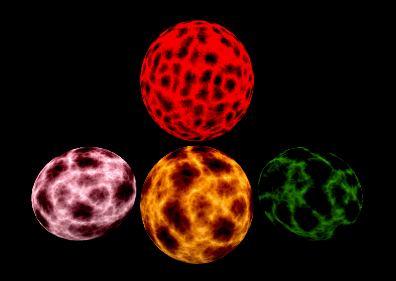

# A-Frame Fireball Component

[Online Demo](https://urish.github.io/aframe-fireball-component/)

## Installation

Add the following line to your html file, just after loading A-Frame:

    

You can also get this component through npm:

    npm install --save aframe-fireball-component

## Usage

Basic usage:

    <a-sphere position="0 1 -5" fireball></a-sphere>

Advanced usage - specifying properties:

    <a-sphere position="2.5 1 -5" radius="1.25" fireball="color: red; brightness: 2; scale: 2.5; speed: 0.2"></a-sphere>

See [index.html](index.html) for a complete example.

## Parameters

| Parameter   | Default | Description |
|-------------|---------|-------------|
| **brightness**  | 1.5        | Brightness level of the fireball |
| **color**       | '#ffaa55'  | Fireball color |
| **opacity**     | 1.0        | Fireball opacity |
| **scale**       | 1.0        | Scaling of the generated texture. Higher values will result in more details |
| **speed**       | 0.1        | Animation speed of the generated texture. Higher values will result in faster animation |

## License

Copyright (C) 2017, Uri Shaked. Distributed under the MIT license.
Based on http://shaderfrog.com/view/76
and http://alteredqualia.com/three/examples/webgl_shader_fireball.html

Original copyright notice: Copyright (C) 2011 Ashima Arts. All rights reserved. Distributed under the MIT License. 
